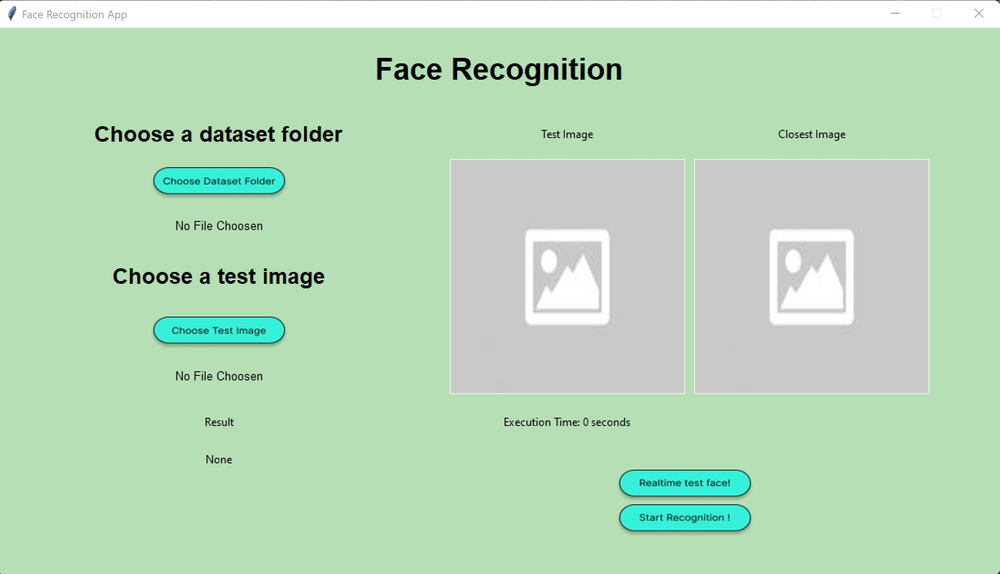

# Face Recognition
Tugas Besar 2 IF 2123 Aljabar Linier dan Geometri
<br />
Aplikasi Nilai Eigen dan EigenFace pada Pengenalan Wajah (Face Recognition) 

## Table of Contents
* [General Info](#general-information)
* [Tampilan Program](#tampilan-program)
* [How To Run](#how-to-run)
* [Tech Stack](#tech-stack)
* [Project Structure](#project-structure)
* [Credits](#credits)

## General Information
Pengenalan wajah (Face Recognition) adalah teknologi biometrik yang bisa dipakai untuk mengidentifikasi wajah seseorang untuk berbagai kepentingan khususnya keamanan. Program pengenalan wajah melibatkan kumpulan citra wajah yang sudah disimpan pada database lalu berdasarkan kumpulan citra wajah tersebut, program dapat mempelajari bentuk wajah lalu mencocokkan antara kumpulan citra wajah yang sudah dipelajari dengan citra yang akan diidentifikasi.

## Tampilan Program


## How To Run
### Run Using Windows Batch File
#### Cara 1 (Manual check the dependencies)
1. Pastikan semua dependencies berikut sudah terinstall
```shell
pip install numpy       # dependencies untuk operasi perhitungan
# and
pip install opencv      # dependencies untuk Face Recognition
# and
pip install tk          # dependencies untuk GUI
# and
pip install pillow      # dependencies untuk GUI
```
2. Di terminal (cmd), jalankan:
```shell
run.bat
```
3. Atau double klik pada file `run.bat`
4. Jika program berhasil dikompilasi, maka akan muncul prompt aplikasi seperti tampilan program di atas.

#### Cara 2 (Auto install dependencies + run)
1. Pastikan Tkinter sudah terinstal:
```shell
pip install tk
```
2. Di terminal (cmd), jalankan:
```shell
complete_run.bat
```
3. Jika program berhasil dikompilasi, maka akan muncul prompt aplikasi seperti tampilan program di atas.

### Run Manually 
1. Pastikan semua dependencies sudah terinstal.
```shell
pip install numpy       # dependencies untuk operasi perhitungan
# and
pip install opencv      # dependencies untuk Face Recognition
# and
pip install tk          # dependencies untuk GUI
# and
pip install pillow      # dependencies untuk GUI
```
2. Pastikan anda berada pada dir `src` dengan :
```shell
cd src
```
3. Jalankan perintah berikut:
```shell
py interface.py
```
4. Jika berhasil, maka akan muncul prompt aplikasi seperti pada tampilan program di atas.

## Tech Stack
### Programming Languange
* Python 3.10.6

### Libraries
* OpenCV
* Numpy
* Tkinter
* PIL

## Project Structure
```bash
.
│   README.md
│   run.bat
│   complete_run.bat
│   requirements.txt
│   .gitignore
│
├───bin
│
├───doc
│
├───src
│   │   eigenface2.py
│   │   interface.py
│   │   main.py
│   │
│   └───assets
│
└───test
```

## Credits
This project is implemented by:
1. Brian Kheng (13521049)
2. Jimly Firdaus (13521102)
3. Marcel Ryan A. (13521127)
